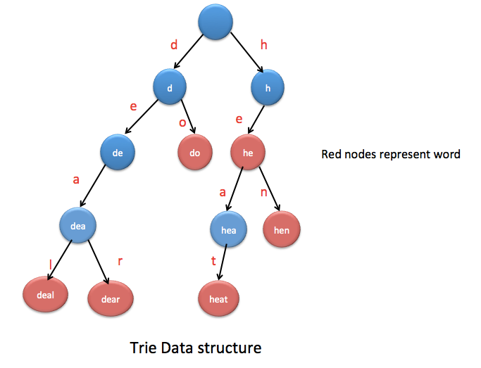

## Tree Map 
A tree map is a map which is sorted on the key values when you pass through with an iterator.

---
## Linked HashMap
A linked Hashmap is used when you want to maintain the order in which you added the elements to the map.

---

## Trie Data Structure 
A Trie data structure is a very useful data structure that can be used to store words which is very easy to search. It stores the subsequent letters recursively in a tree which can be very helpful for searching words.

